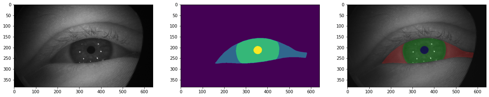

# 👁 OpenEDS Sparse Semantic Segmentation Challenge



## Scores table
Submission File | Config file | Fold 0 | Leaderbord Score
-|-|-|-
baseline.json |baseline.yml | 0.93276 | 0.94215
baseline-tta.json |baseline.yml | 0.93358 | 0.94286
baseline-ensemble-tta.json | baseline.yml | - | 0.94434

## Training
```
python run_train.py <CONFIG_FILE> 
```
Any config param could be overridden in a such way:
```
python run_train.py <CONFIG_FILE> --epochs=1000 --checkpoint.filename=<CHECKPOINT_FILE> --checkpoint.model=True
```


## Create submission
```
python run_inference.py <CONFIG_FILE>  <CHECKPOINT_FILE> <OUTPUT_FOLDER>
python create_json_ss.py --root-folder <OUTPUT_FOLDER> --submission-json <SUBMISSION_JSON>
```

## Weights
https://drive.google.com/drive/folders/1kxgu-PVptBqsSWg7T9qwsaWJa2QlENSY?usp=sharing